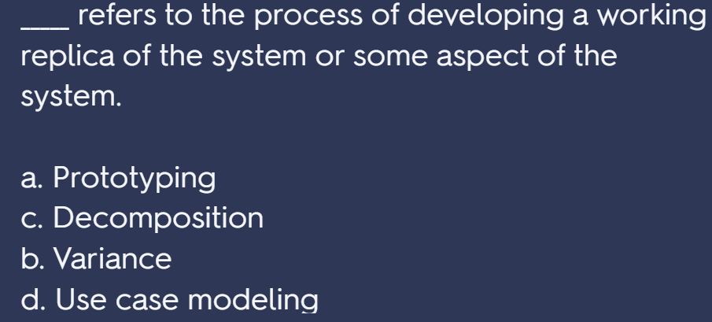
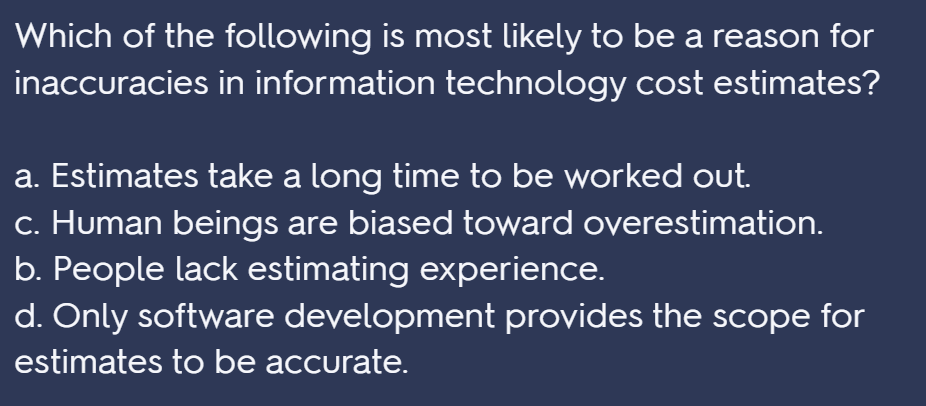

# 第一章 导论

## 知识点

+ 项目约束：范围、时间、成本
+ 项目管理：在项目活动中运用专门的知识、技能、工具和技术，以满足项目需求

## 题

+ 财务管理是招聘方在招聘大学应届毕业生时寻求的顶尖技能

# 错题本+知识补充

## 第五章 scope

+ **Suggestions for Reducing Incomplete and Changing Requirements**

  + Develop and follow a requirements management process that includes 

  procedures for determining initial requirements.

  + Employ techniques such as prototyping, use case modeling, and Joint 

    Application Design to understand user requirements thoroughly. **Prototyping**

    involves developing a working replica of the system or some aspect of the 

    system. Employ techniques such as prototyping, use case modeling, and Joint 

    Application Design to understand user requirements thoroughly. **Prototyping**

    involves developing a working replica of the system or some aspect of the 

    system. Employ techniques such as prototyping, use case modeling, and Joint 

    Application Design to understand user requirements thoroughly. **Prototyping**

    involves developing a working replica of the system or some aspect of the 

    system. 

  + Put all requirements in writing and keep them current and readily available. 

  + Create a requirements management database for documenting and controlling 

    requirements. 

  + Provide adequate testing to verify that the project’s products perform as 

    expected.

  + Use a process for reviewing requested requirements changes from a systems 

    perspective. 

  + Emphasize completion dates. 

  + Allocate resources specifically for handling change requests. 

  + ["开发系统或系统某一方面的工作副本的过程"是指**原型制作**（Prototyping）](https://quizlet.com/373994350/quiz-5-flash-cards/)[1](https://quizlet.com/373994350/quiz-5-flash-cards/)[2](https://quizlet.com/328084139/project-management-chapter-5-flash-cards/)[3](https://www.quizplus.com/quiz/4346-quiz-5-project-scope-management/questions/255333-whichprocessinvolves-developing-a-working-replica-of-the)[。原型制作是一种软件开发方法，它倾向于迭代开发和快速构建原型，而不是大量的预先规划](https://en.wikipedia.org/wiki/Software_development_process)[4](https://en.wikipedia.org/wiki/Software_development_process)。

    让我给你举个例子来解释一下：

    假设你正在开发一个新的网站。在开始编写代码之前，你可能会先创建一个网站的原型。这个原型可能只是一个静态的网页，展示了网站的基本布局和设计。通过这个原型，你可以和其他团队成员（比如设计师、产品经理等）进行讨论，看看这个设计是否符合他们的期望。如果他们对原型有任何反馈或建议，你可以在编写代码之前就进行调整。这样，你可以避免在项目后期进行大规模的修改，从而节省时间和资源。

    总的来说，原型制作是一种强大的工具，可以帮助我们在投入大量资源进行实际开发之前，对产品的设计和功能有一个清晰的理解。

    

+ 

# 第六章 cost

+ Typical Problems with IT Cost Estimates
  •	 Estimates are done too quickly. .
  •	 People lack estimating experience. 
  •	 Human beings are biased toward underestimation. 
  •	 Management desires accuracy. 

  

+ **Reality Checks on Scheduling and the Need for Discipline**

  

+ 