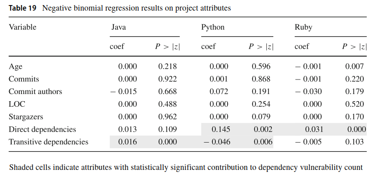
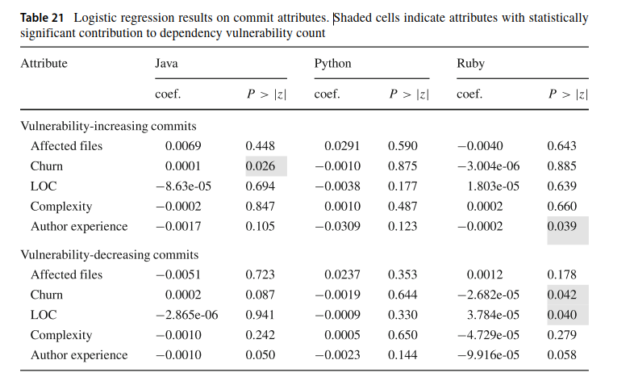

# METAGPT: META PROGRAMMING FOR MULTI-AGENT COLLABORATIVE FRAMEWORK

## 摘要

+ hallucination 幻觉问题 
+ cascade 倾泻 叠加
+ innovative 革新的
+ incorporate 合作；成功
+ subsequentl 随后
+ mandate 授权 赋予 命令 强制
+ validate 验证
+ compound 混合 组成
+ leverage 充分利用
+ framework+sop标准化操作为promote+modular output 模块化输出

## introduction

+ 问题 对话和简单交互 无用的循环 sop提高效率
+ In this work, we present MetaGPT, a meta programming technology that utilizes SOPs to coordinate LLM-based multi-agent systems. SOPs serve as our strategy for organizing the collaboration of multi-agents which enhances the efficiency of their cooperative efforts. Firstly, each agent is identified by descriptive information, which allows the system to initialize with an appropriate role-specific prompt prefix. This approach integrates domain knowledge into agent definitions. Secondly, we analyze efficient human workflows to encapsulate procedural knowledge required for collaborative tasks. These SOPs are encoded into the agent architecture using role-based action specifications. Finally, a shared environment connects agents, providing visibility into their actions and enabling them to collaborate, access tools, and share resources. Agents produce standardized action outputs to facilitate knowledge sharing. Additionally, agents in MetaGPT can actively observe and retrieve relevant information, which is a more efficient approach compared to passively receiving data through dialogue. The environment mirrors the infrastructure of human workplaces that facilitate team collaboration.
+ structured processes, agent collaboration, and advanced model-driven techniques is transforming the landscape of software development
+ • Introduction of a meta programming framework
+ Integration of human SOP process design. 

## related work

+ LLM-based Automatic Programming

  Besides, A series of the fundamental works on which this paper is based need to be mentioned. ReAct utilizes Chain of Thought prompts to generate reasoning trajectories and action plans with LLMs. Reflexion infers more intuitive future actions through self-reflection. Both papers illustrate how the Re-Act style loop of reasoning is a good design paradigm for empowering LLM-based agents. ToolFormer can teach themselves to use external tools via simple APIs. SWIFTSAGE assigns difficult situations to slow thinking to deal with, while normal situations are dealt with directly by fast thinking. Based on the above design, we emphasize that role division of labor is helpful for complex task processing
  
+ Multi-agent Collaboration

  However, their cross-agent communication is natural language conversations, not a standardized software engineering document, and does not incorporate advanced human process management experience. The key issues persist in multi-agent cooperation around maintaining coherence, avoiding unproductive loops, and directing beneficial interactions.
  Therefore, this paper emphasizes the practice of advanced human processes (e.g., SOPs in software development) in multi-agent systems
  
+ Autonomous System Design

  与其他比较：好在哪里

  Existing autonomous systems like AutoGPT automate tasks by breaking down high-level goals into multiple sub-goals and executing them in ReAct-style loops, while facing challenges with coherence and validation. LangChain helps develop LLM applications in combination with other computational tools or knowledge bases. Recently, the multi-agent architecture has been proven to be an effective design. GPTeam creates LLM-based multiple agents that work together to achieve a predetermined goal. AgentVerse is a LLM powered multi-agent scenario simulation framework. Langroid builds LLM-based multi-agent programming.
  SocraticAI improves problem-solving by leveraging the power of multiple agents in socratic dialogue. Since
  most of them are not embedded in advanced human management experience, they are unable to solve larger and more complex real-world projects. Our MetaGPT incorporates human workflow insights for more controlled and validated performance

## Meta Programming for Collaborative Agents via Standardized Operating Procedure

+ 框架Framework Overview

+ MetaGPT的设计分为两个不同的层

  + 基础组件层。此层建立单个代理操作和系统范围信息交换所需的核心构建块，包括环境、内存、角色、操作和工具。

    Foundational Components Layer. This layer establishes core building blocks necessary for individual agent
    operations and system-wide information exchange, including Environment, Memory, Roles, Actions, and Tools. As depicted in Figure 2, Environment enables shared workspace and communications. Memory stores and retrieves historical messages. Roles encapsulate domain-specific skills and workflows. Actions execute modular sub-tasks.
    Tools provide common services and utilities. This layer offers an underlying infrastructure for agents to function in assigned roles, interacting with each other and the system
    
  + 协作层。协作层建立在基础组件层之上，协调各个代理以协作解决复杂问题。它建立了基本的合作机制：知识共享和封装工作流程。知识共享。这种机制允许代理有效地交换信息，有助于共享知识库。代理可以存储、检索和共享不同粒度级别的数据。
    它不仅可以增强协调，还可以减少冗余通信，从而提高整体运营效率。

    封装工作流程。此机制利用 SOP 将复杂任务分解为更小、可管理的组件。
    它将这些子任务分配给合适的代理，并通过标准化输出监督他们的表现，确保他们的行动与总体目标保持一致。

  + 
  
+ Core Mechanism Design

  + Role Definitions：ProductManager, Architect...

    + a set of key attributes: name，profile, goal, constraints, and description.
    + 配置文件 体现了角色或职务的领域专业知识。
      例如，架构师的配置文件可能包含软件设计，而产品经理的配置文件可以专注于产品开发和管理。
    + 目标 代表角色寻求实现的主要责任或目标。
      产品经理的目标可以用自然语言来表示，有效地创建一个成功的产品。
    + 约束 表示执行操作时角色必须遵循的限制或原则。
      例如，工程师在编写标准化、模块化和可维护的代码时可能有约束。约束可能规定为 您编写的代码应符合 PEP8 等代码标准，是模块化的、易于阅读和维护的
    + 说明 提供了额外的具体标识，以帮助建立更全面的角色。
    + MetaGPT 框架中的角色初始化使用自然语言来全面描述每个角色的职责和约束。
    + 角色不仅有助于人类理解，而且还指导LLM生成与角色配置文件一致的操作，使每个代理能够熟练掌握各自的任务。
    + 我们将此过程定义为锚代理，它帮助人类将特定于域的职责和功能编码到基于 LLM 的代理中，并添加有关预期功能的行为指南。
    + 在 MetaGPT 中，智能代理不仅可以接收和响应信息，还可以观察环境以提取关键细节。这些观察指导他们的思考和随后的行动。
      最后，从环境中提取重要信息并存储在内存中以供将来参考，有效地使每个智能体都成为主动学习者。这些代理承担专门的角色，并遵循某些关键行为和工作流
    + Think & Reflect.+Observe.+Broadcast messages.+Knowledge precipitation & Act.+State management.
    
  + Prompts Instantiating SOPs
  
    + MetaGPT 框架中的顺序软件开发过程。
      收到人类的需求后，产品经理通过进行需求和可行性分析来开始该过程。然后，建筑师为项目制定特定的技术设计。
      接下来，项目经理执行序列流图以满足每个需求。工程师负责实际的代码开发，然后由质量保证 （QA） 工程师执行全面测试。
  
      
  
    + MetaGPT 使用提示将现实世界的 SOP 实例化为定义明确的代理工作流
  
    + Action class （through natural language) key attributes:
  
      + Prefix.建立角色上下文
  
      + LLM proxy.
  
      + Standardized outputs schema.
  
      + Instruct content.
  
      + Retry mechanism启用重试操作以实现稳健性的尝试次数和等待时间定义
  
      + 综上所述，MetaGPT 中的每个动作都需要通过编码高质量的专家级结构关键点来定义标准化输出。然后，LLM 根据特定任务的标准化输出架构优化操作。
        从本质上讲，我们为每个操作提供了一个符合角色标准的提示模板。此模板有助于指导 LLM 的行为以生成规范化输出。
  
        我们在 MetaGPT 中为 ProductManager 代理定义了一个 WritePRD 操作来展示该过程。
        如图 3 所示，我们通过指定所需的输出（包括产品目标、用户案例、竞争分析、需求分析和优先级需求池）来整合此操作的领域专业知识。
        这些输出封装了遵循行业惯例的产品管理中的关键工件和实践。
        此外，我们还为 ProductManager 代理提供了支持技能，例如用于增强分析的 Web 搜索 API，以及用于可视化竞争象限图表的图表工具（如美人鱼 [42]）。产品经理有效地构建输出部分。
        通过为代理配备这些与实际产品管理职责相一致的互补功能，WritePRD 操作可以在遵守标准化工作流程的同时执行子任务。
  
        通过这种方式，WritePRD 操作举例说明了 MetaGPT 操作定义如何结合领域知识、输出模式和辅助技能，将高级 SOP 转换为代理的可执行和可自定义过程。
        通过将现实世界的最佳实践整合到行动规范中，MetaGPT 将理论专业知识与为协作工作流程定制的结构化执行联系起来。此外，每个动作都不仅仅是一个孤立的功能。
        它构成了一套全面的指导方针的一部分，这些指导方针管理LLM在其角色内的行为，确保产生高质量，组织良好和特定于任务的产出。
  
    + Actions for Standardized Outputs
  
      + 标准化输出。这些输出利用专家领域知识和行业最佳实践来调整工作流程以适应特定的角色和上下文。
  
        标准化输出促进了一致的LLM结果，这些结果是可预测的，可重复的，并且符合代理职责。它们通过设置输出期望来指导高质量、结构化和特定于任务的 LLM 生成。
  
        •此外，标准化架构充当蓝图，将 LLM 行为限制在角色的适当边界内。这有助于保持对目标任务的关注并防止题外话。
        由于行动构成了基于角色的综合指南的一部分，这种具有角色意识的指导可将 LLM 行为限制在角色的适当边界内
  
        
  
        如图 4 所示，架构师代理生成详细的系统来说明软件架构。该图包括关键模块的明确定义，例如User，CollaborativeFilteringModel和Recommender。
        该图补充了有关每个模块中的关键字段和方法的信息，可帮助工程师更好地了解基本工作流和功能组件。
  
        此外，该设计还结合了模块之间的调用关系，遵循系统级关注点分离和松散耦合的原则。
        从人类自然语言到结构化技术设计的翻译提供了具体和实用的信息，可以帮助实施工程项目。
  
        尽管系统设计提供了整体框架和模块化设计，但工程师实现复杂的系统编码仍然不够。工程师仍然需要有关如何在模块之间将设计转换为功能代码。
        如图 5 所示，架构师还基于系统接口设计创建了一个序列流程图，描述了执行功能所需的流程、所涉及的对象以及它们之间交换的消息序列。
        如前所述，这些补充细节使协作更容易，特别是对于负责详细设计代码的工程师和项目经理。
  
        因此，架构师角色的一致、协同输出对于通过简化工程师将规范转换为功能代码的任务来提高代码质量至关重要。
        它们减少了自由形式的自然语言可能产生的歧义、误解和混乱。
  
        
  
    + Knowledge Sharing Mechanism & Customized Knowledge Management
  
      + 在 MetaGPT 中，每个代理通过从共享环境日志中检索相关历史消息来主动管理个性化知识。代理不是被动地依赖对话，而是利用基于角色的兴趣来提取相关信息。
  
      + 代理不是被动地依赖对话，而是利用基于角色的兴趣来提取相关信息。
        具体而言，环境复制消息以提供统一的数据存储库。代理根据对其角色有意义的消息类型注册订阅。将自动调度匹配的消息以通知相应的代理。
        在内部，代理维护一个内存缓存，该缓存按内容、发布代理和其他属性为订阅的消息编制索引。检索机制允许代理通过查询此存储来获取其他上下文详细信息。
        更新在链接代理的内存之间同步，以保持一致的视图。这种分散但统一的访问模式反映了人类组织的运作方式。团队成员具有共享记录，但根据其职责自定义其视图。
        通过根据代理角色构建信息流，MetaGPT 使自主代理能够有效地访问相关知识。
  
        如前所述，MetaGPT 中的每个代理都维护一个内存缓存，用于索引与其角色相关的订阅消息，从而实现个性化的知识管理。具体而言，消息的集中复制可创建统一的数据源。
        代理可以注册订阅以自动从此源接收与角色相关的消息。在内部，代理按内容、源和属性为内存缓存编制索引，以便于在相关上下文中快速检索。
        这种分散但联合的知识生态系统不是依赖于一刀切的通信，而是反映了人类团队根据个人职责定制信息视图的方式，同时仍然依赖于共享记录。
  
      + Message sharing.+Role-based subscriptions.+Message dispatch.+Memory caching and indexing+Contextual retrieval+Updates synchronization+
  
    + A Multi-Agent Collaboration Example示例
  
      + This section elaborateson Figure 3 with a more detailed breakdown of MetaGPT that uses waterfall SOP. When prompted with "Make the2048 sliding tile number puzzle game"
  
      + MetaGPT能够从一行用户指令生成整个软件系统。本节详细阐述使用瀑布式SOP的MetaGPT的更详细的分解。当提示“Make the。2048滑动瓷砖数字解谜游戏”
  
      + 当老板（用户）提出产品需求时，产品经理Alice将起草7条文档，包括产品目标，用户故事，竞争分析（文本和象限图），需求分析，需求池和UI设计。
        在 Alice 根据瀑布式 SOP 将她的工作移交给下一个 LLM 角色之前，将首先审查她的工作，如图 3 所示。审核结束后，Alice 会将她的作品发布到“WritePRD”类别下的消息队列中。
        Bob，我们的LLM架构师，订阅了“WritePRD”类别
  
      + 根据Alice的需求分析和可行性分析，我们的
        架构师将为项目起草一个系统设计，它从一个高层次的实现方法开始
  
        按照实施计划，架构师 Bob 将创建一个文件列表，将计划的复杂逻辑原子化为几个文件
  
        并生成美人鱼图以定义数据结构和接口以及程序序列流程图。
  
        Bob 将根据设计继续生成文件目录和空文件，并将他的所有工作（文档和图表）发布到“WriteDesign”类别下的消息队列中。
  
        Eve（项目经理）：准备编写任务。
        
      + Eve 订阅了“WriteDesign”类别，并使用所有先前起草的 UI、系统设计和 API 设计文档将项目分解为更简单、更具可操作性的任务，通常是单个文件的复杂性级别：
  
        此外，项目经理 Eve 将列出项目依赖项，包括用 Python 编写的第三方包以及其他语言和 API 规范。
        当缺少细节时，审阅/反思过程将迭代改进当前阶段生成的内容，直到审阅者满意为止。
  
      + Alex（工程师）：准备编写代码和编写代码审查。给定具体任务和“WriteTasks”消息形式的连贯的整体实施计划，基于 LLM 的代理有足够的信息来生成无错误的代码。
        Alex 将按指定顺序浏览文件列表并生成每个文件。在第一次尝试中，MetaGPT 成功生成了一个无错误的 2048 滑动瓷砖益智游戏。所有这些都来自一行用户指令。

## 实验

  + Code-generation Benchmarks 代码评估

    + 任务选择。
      为了评估 MetaGPT 框架在代码生成中的性能，特别是在单文件场景中，并证明其多代理协作的有效性，我们使用两个开源基准 HumanEval[24] 和 MBPP[25] 进行评估，以评估代码生成性能。
      HumanEval 基准测试包括 164 个手写编程任务。每个任务都包括函数规范、说明、参考代码和多个单元测试。MBPP 基准测试由 427 个经过手动验证的 Python 编程任务组成。
      这些任务涵盖基本的编程概念和标准库功能。每个任务都包括说明、参考代码和多个自动测试用例。
    + 基线和度量 我们利用 [24] 提供的无偏Pass@k版本来评估 top-k 生成代码的功能准确性。
    + 结果
      

  + Complex Task Evaluation Methodology 复杂任务评估

    + 
      评估指标。为了精确评估实验结果，我们制定了一组指标，考虑了代码质量、文档、成本统计、修订成本和代码可执行性。

      
      框架功能比较。MetaGPT 以其广泛的功能而与众不同。MetaGPT 的独特之处在于能够生成 PRD 和技术设计，展示了其项目执行的整体方法。
      MetaGPT 是唯一能够生成 API 接口的框架，这在快速 API 设计原型场景中提供了优势。

      代码审查是开发过程的关键阶段，在 MetaGPT 和 AgentVerse 中都可用，但在 AutoGPT 和 LangChain 中明显不存在。
      MetaGPT 通过集成预编译执行进一步区分自己，该功能可促进早期错误检测并提高代码质量。
      在协作功能方面，MetaGPT 和 AgentVerse 都支持基于角色的任务协作，这是一种鼓励多智能体协作并通过将任务分配给特定角色来增强团队合作的机制。
      但是，MetaGPT 专门提供基于角色的任务管理，该功能不仅可以分解任务，还可以监督其管理，突出了其广泛的项目管理功能。

      在评估代码生成能力时，所有这些框架都表现出熟练程度。但是，MetaGPT 提供了一个更全面的解决方案，解决了开发过程中更广泛的方面，并为项目管理和执行提供了完整的工具集。

      这种比较基于各个框架的当前状态。将来的更新可能会添加或修改这些工具的功能。
      然而，截至本分析，MetaGPT 在为项目执行提供更全面、更强大的解决方案方面优于同行。

    + 定量实验比较。为了评估各种框架（如MetaGPT，AutoGPT，LangChain和AgentVerse）的性能，我们在7个不同的任务中进行实验。这些任务包括 Python 游戏生成、CRUD 代码生成和简单的数据分析。
      这种方法旨在阐明所研究的每个框架的独特优势和劣势。结果如表

## 消融研究

多个角色的存在不仅提高了代码质量，而且还增强了代码实现的鲁棒性和可行性。

总之，通过跨条件的定量比较，我们强调了专用多智能体框架在复杂任务中的优势。此类框架验证了角色模块化和协作对于整体任务完成的重要性。

## Discussion and Future Work

  尽管 MetaGPT 在自动化端到端流程方面具有巨大潜力，但它也有一些局限性。首先，它偶尔会引用不存在的资源文件，如图像和音频。
  此外，在执行复杂任务期间，它很容易调用未定义或未导入的类或变量。这些现象广泛存在归因于大型语言模型中固有的幻觉倾向，可以通过更清晰、更高效的座席协作工作流程来处理。

## 结论

  在这项工作中，我们提出了MetaGPT，这是一个有前途的框架，用于使用SOP的协作代理，利用LLM来模仿高效的人类工作流程。MetaGPT 是一种元编程技术，它利用 SOP 来协调基于 LLM 的多代理系统。具体来说，为了将SOP编码为提示，MetaGPT通过角色定义，任务分解，流程标准化和其他技术设计来管理多代理。
  它最终只需一行要求即可完成端到端开发过程。

  我们在软件开发中的说明性示例通过详细的SOP和提示展示了该框架的潜力。
  实验结果表明，与现有的基于会话和聊天的多智能体系统相比，我们的 MetaGPT 可以生成具有更高一致性的综合解决方案。

  我们相信，这项工作为多智能体的交互和合作方式开辟了新的可能性，重新定义了复杂问题解决的格局，并指出了通向通用人工智能的潜在途径。

## 参考

关于MetaGPT多智能体的n个问题https://zhuanlan.zhihu.com/p/650375126

中文文献 https://zhuanlan.zhihu.com/p/650375126

etaGPT技术全解析：另一个AutoGPT，一个可以替代小型软件开发团队的配备齐全的软件开发GPT，产品经理、系统设计、代码实现一条龙https://blog.csdn.net/sinat_37574187/article/details/132206883

MetaGPT：目前可用的最佳 AI 代理的完整指南（安装）https://www.unite.ai/zh-CN/Metagpt-%E7%9B%AE%E5%89%8D%E5%8F%AF%E7%94%A8%E7%9A%84%E6%9C%80%E4%BD%B3%E4%BA%BA%E5%B7%A5%E6%99%BA%E8%83%BD%E4%BB%A3%E7%90%86%E5%AE%8C%E6%95%B4%E6%8C%87%E5%8D%97/

MetaGPT作者深度解析直播回放https://www.bilibili.com/video/BV1Ru411V7XL/?share_source=copy_web&vd_source=1bfd5c1f49f14b4dfa644096d3b6f5ab

# 开源讨论2：Out of sight, out of mind? How vulnerable dependencies affect open-source projects

## Abstract

### 背景

软件开发者会使用开源库来提高编码效率，但是这些库里可能包含许多安全漏洞。近几年来就发生了几件基于此的备受瞩目的负面事件。

> 1. **Heartbleed漏洞**：这是一个在OpenSSL库中发现的严重漏洞。OpenSSL是一个广泛使用的开源库，用于在网络上加密通信。OpenSSL库中的缓冲区过读，导致Heartbleed漏洞，允许攻击者从受影响的服务器中读取内存信息，包括用户的私钥、用户名和密码等敏感信息。该漏洞于2012年引入，但直到2014年才被发现。
> 2. **Shellshock漏洞**：这是一个在Bash shell中发现的严重漏洞。Bash shell是Linux和Unix系统中默认的命令行解释器，也被许多其他软件用作脚本语言。Shellshock漏洞允许攻击者执行任意命令，从而完全控制受影响的系统。
> 3. **Apache Struts 2漏洞**：Apache Struts 2是一个用于创建Java Web应用程序的开源框架。2017年，研究人员在Struts 2中发现了一个严重的远程代码执行漏洞。是Apache Struts中未修补的CVE-2017-5638漏洞，该漏洞导致了信用报告公司Equifax大规模数据泄露事件。
> 4. **CVE-2018-1000006漏洞**：2018年1月在流行的Electron框架中发现的CVE-2018-1000006漏洞影响了使用该框架构建的许多Windows应用程序，如Skype和Slack。

所以说，随着开源库的不断壮大，对开源库的使用越来越频繁，那么开源库中存在的安全漏洞一定要引起重视。

### 目标

分析检查(由java、python、ruby等语言编写的)450个软件项目中的漏洞的种类、分布、严重性、持续性，以及漏洞流行性普遍性与项目、提交属性之间的关系。

从而可以回答问题：

+ 使用库的时候应该注意哪些类型的依赖漏洞？知道普遍漏洞，针对共性问题有意识，避免未被处理或者提出的漏洞。
+ 对于库的开发者来说，尽快的修复漏洞并发布是不是就够了？避免过时漏洞，积极更新
+ 在更新较少的情况下，这些漏洞被处理的频率？
+ 增加人力能有效改善开源库依赖安全漏洞的情况吗？通过人力和经验的数据，帮助以后更好做开发的决策
+ 帮助研究者去研究更有益的方向

### 方法

数据通过使用工业软件组合分析工具SCA，扫描2017年11月1日至2018年10月31日之间所有样本项目的所有提交后的版本，该工具提供了库的名称和版本，依赖类型(直接或传递)以及已知漏洞等信息。

### 结果

+ 通过其他的研究，我们发现，项目的活动水平，受欢迎程度，开发者的经验丰富程度对依赖漏洞问题的解决和处理没有影响。

+ “Denial of Service” and “Information Disclosure” 拒绝服务和信息披露在所研究的编程语言（Java、Python 和 Ruby）中很常见。

  > **拒绝服务**就是攻击者故意导致目标用户无法访问系统或网络。这可以通过使用过多的请求使系统不堪重负或利用系统资源分配中的弱点来实现。
  >
  > 比如说，攻击者向 Web 服务器发送大量请求，使其资源不堪重负，导致其对合法用户没有响应。
  >
  > 上学期软测课程，测试校园网负载

  > **信息披露**就是软件应用程序无意中将敏感的用户数据（例如密码或个人信息）暴露给未经授权的个人
  >
  > 比如说，网站的开发者没有正确地配置数据库的访问控制，设置所有密码是123456，导致任何人都可以通过互联网访问到这个数据库。这就是一个信息泄露漏洞。未经授权的个人（例如黑客）可以利用这个漏洞，访问数据库并获取所有用户的姓名、电子邮件地址和密码。这就导致了数据泄露，危及了用户的隐私和安全。

+ 大部分依赖漏洞会一直存在（起码在这个文献实验过程中，整个观察期都是如此），即使漏洞被解决了，也需要3-5个月去进行修复。

  ==被修复的是什么？ 我的猜测：==

  > 漏洞知道了并且知道解决方法后，一是，依赖这个库的项目要设计一个解决方案来修复这个漏洞，对可能的修复方案进行讨论和选择。花时间修改代码来修复漏洞。修改后的代码需要进行详细的测试，以确保它能够有效地修复漏洞，同时不会引入新的问题。经过代码审查，并合并到主分支。新版本的需要发布，并通知用户更新以获取修复。二是可能要与库的开发者沟通，去获取最新的库。

  

### 结论

+ 强调管理好大量的依赖并及时更新
+ 优先考虑一些领域，比如说预防和减轻“denial-of-service”，可以大幅度提高广泛安全性

## 1Introduction

> 现在软件很多都用第三方库来提高编码效率。通过中央库（比如maven、pypi）和一些依赖工具可以帮助开发人员下载、安装、调用开源库。
>
> 但是，开源库有漏洞。软件与库的关系复杂，第三方库之间可能还有依赖关系。使得依赖关系错综复杂，漏洞也隐匿其中。

+ 作用和意义见摘要目标

+ 工具选择Veracode SCA

  + 他可以识别使用的开源库、与这些库相关的漏洞(包括那些尚未出现在公共漏洞数据库中的漏洞)、相关许可证和其他指标。

  + 使开发团队能够识别易受攻击的依赖项和其他潜在问题，如过时的依赖项和许可问题。

+ 重点 **回答问题**：

  + **RQ1: What are the common types and prevalence of dependency vulnerabilities in open-source software, and how persistent are they?**

    开源软件中有哪些常见或普遍的依赖漏洞？他们持续性怎么样？

    > + 还能评估现在问题的严重性 比如数量难度
    > + 然后如果是常见有解决方法的漏洞，可以帮助我们解决或减轻

  + **RQ2: What are the relationships between vulnerabilities in a project’s open source dependencies with the attributes of the project and its commits?**

    项目的属性和他的提交与项目依赖中的漏洞有怎样的关系？

    > +  依赖漏洞的数量符合这个规律吗：“many eyes make all bugs shallow”by Eric Raymond and is known as Linus’ Law (Raymond 1999)
    > + 因为在预测漏洞时会考虑项目的多项指标（通过复杂度、流失，开发者行为），所以在研究项目与漏洞的关系时，也要考虑这些指标
    > + 与项目活跃程度（内部开发）、受欢迎程度（外部关注）、提交规模（模块还是文件巴拉巴拉修改）和开发人员的经验水平相比，漏洞数与项目对第三方库的依赖总数更有关（包括直接和间接）

## 2Overview of  Veracode SCA

换个说法是为什么选择SCA吧

+ 软件组成/成分分析工具

+ 包括这些依赖库各自的许可证、已知漏洞和最新可用版本

+ 适用于多种编程语言：Java, Python, .NET, Ruby,JavaScript, PHP, Scala, Objective C, and Go

+ 工作原理

  

  > 源码——构建工具构建项目——生成依赖图——通过依赖图识别出使用的开源库——获取这个开源库的相关信息（版本，漏洞情况等）——报告项目使用的开源库、库的具体版本、它们的许可证、相关的漏洞以及过时库的使用情况

+ Veracode SCA包括静态检查机制，以帮助库更新+安全图语言，旨在描述和表示漏洞，可以查询开源库、内容（方法与类）和漏洞之间的关系

  >  例如库中的漏洞如何与这些库中的特定文件或功能相关

+ 可以检测常见的漏洞、在CVE列表中的漏洞、以及一些没有被赋予cve标识符的漏洞

+ 漏洞数据来源：国家漏洞数据库(National vulnerability Database)的公开的漏洞信息+内部的研究成果发现的尚未公开的漏洞

  > Veracode研究人员通过各种方法来识别新漏洞并将其添加到数据库中
  >
  > 例如应用自然语言处理和机器学习模型来识别与漏洞相关的提交和错误报告。
  >
  > 机器学习模型精度和召回率高
  > 在试验期间，SCA能够检测到比CVE同期报告的实际漏洞数量更多的漏洞。
  >
  > 超越了基于svm的分类器，后者是从提交消息和bug报告中检测漏洞的最先进方法之一。

+ 每个漏洞至少有两名研究人员检测

+ 跟踪用户对漏洞数据库的反馈

+ 对漏洞进行评分，还有标签（标注他是什么类型的漏洞或者在什么情况下发生）

## 3Dataset & Methodology 数据与方法
### 	3.1Dataset Collection

+ github有很多仓库并不包含软件

+ 使用前人的提供的软件列表

  > 来自Munaiah等人的reaper数据集，该数据集提供了可能包含软件项目的存储库列表

+ 设置项目抽样标准 语言，时间，可用sca

  + 多种流行语言——可泛化性，有普遍意义+不同语言是否有漏洞特征的差异

+ 抽样450个 每个语言150个 **结果：间接依赖比直接依赖多 提交的人数和依赖数没有关系**

  

  

  

### 	3.2Methodology

用sca检测生成报告，对易受攻击的开源依赖项及其相关漏洞的信息进行后续分析。

> 因为漏洞有CVE已标识的公开类型，也有veracodeSCA研究人员发现的未被标示的漏洞，所以用SCA为每个漏洞分配的工件ID来区分。
>
> 软件项目、库版本和工件ID的组合计算为单个漏洞实例。

## 4 Empirical Study Results

对抽样项目的开源依赖项中的漏洞特征的调查结果+漏洞与项目和提交属性的关系。

### 	4.1 RQ1: What are the ==Common **Types and Prevalence**== of Dependency Vulnerabilities in Open-Source Software, and How **==Persistent==** are They?
#### 		4.1.1Dependency Vulnerability Counts

依赖漏洞数

+ 漏洞总数分布 通过语言和CVE是否标识区分

  

  Java样本集在漏洞数的总体范围和变化上最大，其次是Ruby样本集。

+ 类型 直接或间接

  

  依赖类型的漏洞数与依赖类型的比例有关。

  不同编程语言的漏洞数不同，与不同依赖类型的比例有关。

  Python项目，大部分的依赖性漏洞都在项目的直接依赖项中

  Java和Ruby项目的传递依赖项中漏洞的百分比较高，

+ **发现1：依赖类型的漏洞数比例因编程语言而异，与依赖类型的比例有关**

#### 		4.1.2Most Common Dependency Vulnerability Types

常见的依赖漏洞种类

分别计算库版本、漏洞和项目的每个组合。 实例=库版本×漏洞类型×项目数

+ 使用SCA数据库中的标记tag来分类。识别与每个漏洞实例（一个漏洞可能有多个实例）的标签，计算每个标签的总数，并列出数量最多的标签。

  > 1. **识别每个漏洞实例中的SCA给的标签**：识别每个漏洞实例相关的标签，包括各种漏洞类型，如“拒绝服务”、“信息披露”等。查看每个漏洞，并确定它与哪些标签相关。
  > 2. **计算每个标签的总数**：接下来，计算每个标签的总数。
  > 3. **列出计数最高的标签**：然后，他们列出计数最高的标签。即常见。

  

+ 结果表明，每种语言的依赖漏洞类型之间存在一些共性，“拒绝服务”和“信息披露”是三种语言中最常见的两个问题。开源库开发人员和安全研究人员可以重点关注一下。

+ **发现2：“拒绝服务”和“信息泄露”在编程语言中很常见。**

#### 		4.1.3Distribution of Severity Scores

前面谈的是数量，现在我们来谈谈严重性

+ 大多数漏洞不严重

+ 常见的漏洞也不严重

  

+ 但java和python语言编写的项目，相对来说会有高严重性的漏洞

+ java和python开发者可以通过及时更新依赖来减少漏洞，提高质量

  

+ **发现3：大多数依赖漏洞都是中等严重程度的，但在不同的编程语言中，严重程度分布有明显的差异。**

#### 		4.1.4Vulnerable Libraries Affecting Largest Number of Sampled Projects

有漏洞的库对样本的影响

+ 不论一个库有多少个漏洞，只要它被一个项目使用，就会被计为一个。相当于他影响了一个项目。不看库的版本

  

+ 一个存在漏洞的库不仅会影响到自身，还会通过其他依赖它的库影响到整个包生态系统的安全性。因此，他们计算了一个库平均影响到的库数量，这是通过在不同的包生态系统（Java的Maven，Python的PyPI，Ruby的Gem）的依赖关系图中计算传递闭包的平均出度来测量的。

  > 在数据收集开始时（2018年12月），Java为81.9，PyPI为10.3，Gem为62.2。这表明，在样本集中，受最易受攻击的Java和Ruby库影响的项目数量较多，是因为在Maven和Gem生态系统中，平均库具有更广泛的影响。这反过来表明，改善这些生态系统的安全性将使更广泛的项目受益。

+ **发现4:Java和Ruby中最易受攻击的库影响的项目数量相对较多，这与库在其包生态系统中的平均影响范围一致。**

#### 		4.1.5Non-CVE Dependency Vulnerabilities as Discovered by Veracode SCA

sca发现的没有cve标识的漏洞

+ > 关于漏洞应该多快公开披露，人们的观点各不相同，因为需要考虑到潜在的供应商和攻击者的反应。
  >
  > > 一方面，如果立即公开披露漏洞，那么供应商（即软件的开发者或维护者）就可以立即开始修复这个漏洞。同时，用户也可以了解到这个漏洞的存在，并采取措施保护自己，比如暂时停止使用这个软件，或者寻找替代方案。
  > >
  > > 另一方面，如果立即公开披露漏洞，那么攻击者也会知道这个漏洞的存在。如果供应商无法立即修复这个漏洞，那么攻击者可能会利用这个漏洞发动攻击
  >
  > 
  >
  > 因此，研究人员发现漏洞和漏洞被包含在CVE列表中之间通常会有一段时间延迟。由于这个延迟，即使开发者积极监控并响应CVE更新，他们也可能会错过他们项目依赖项中的一些漏洞。
  >
  > 
  >
  > 研究人员通过评估在样本项目的最新提交中，那些在扫描时尚未被分配CVE ID的依赖性漏洞的平均百分比，来研究这种风险的程度。

  

+ **发现5:仅仅依赖于公共漏洞数据库可能会导致开发人员错过很大比例的依赖漏洞。**

#### 		4.1.6Overall Persistence of Dependency Vulnerabilities

依赖漏洞的整体持久性

+ 库开发人员修复漏洞需要时间。

  >  许多cve会影响一个库的多个版本，因此即使库更新了，它们也会持续存在。

+ 库的使用者更新有延迟。

+ 研究内容：

  + 风险不同的每种语言的持久性漏洞的百分比——首次提交中发现的漏洞的存活率与其风险评级之间没有明显的关系。

    

    

    > 例如，评级为“Low”的漏洞在Java和Python示例项目中持久性最低，但在Ruby示例项目中持久性最高。这表明，高总体持久性不是由项目所有者优先解决高风险漏洞而推迟更新以解决低风险漏洞造成的。

    **风险评级和持久性没关系**

  + 大量项目，库版本自第一次提交以来就没更新过

    

    

  + 大多数情况，即使有新版本的库，也没更新依赖

    

  + 更新依赖也解决不了的漏洞很少，只占持久性漏洞一小部分

    

+ **发现6:尽管有更新的库可用，但项目所有者并不经常更新或更改依赖项，因此包含的任何漏洞都将持续存在。**

  > 表明，漏洞的持久性更多是由更新依赖项时的延迟造成的，而不是漏洞本身在库版本之间的持久性。

#### 		4.1.7Change of Number of Dependency Vulnerabilities Over the Period of Observation

在实验的观察过程中，依赖漏洞数量的变化

+ **发现7:尽管依赖项数量略有增加，但依赖项漏洞数量在1年的研究期间并未增加。**

#### 		4.1.8Time Required to Resolve Dependency Vulnerabilities

解决依赖漏洞所需的时间

+ 发现8:平均而言，解决的依赖漏洞需要3-5个月的时间来修复。
  对于CVE漏洞，我们的Java、Python和Ruby数据集的平均解析时间分别为145.3、134.5和98.8天。对于无CVE的漏洞，Java的平均时间为136.3天，Python为101.3天，Ruby为94.1天。

### 	4.2RQ2: What are the ==Relationships== Between Dependency Vulnerabilities in a Project's Open-Source Dependencies with the ==Attributes== Of the ==Project== and its ==Commits==?

#### 		4.2.1Project Attributes

> A popular view regarding open-source software development is reflected in Linus’ Law
> as formulated by Eric Raymond : “Given enough eyeballs, all bugs are shallow”.

> “too many cooks spoil the broth”

> 更高的项目复杂性和更大的项目规模往往导致项目更容易出现bug，所以作者决定检查OSS依赖漏洞是否对应于一些项目级别的度量:项目受欢迎程度、复杂性和规模。

+ 受欢迎程度 指标：提交作者的数量以及GitHub的观星者数量。

+ 项目复杂性 指标 ：直接和传递依赖数

+ 假设：更大的项目依赖关系网络将使项目维护者更难以跟踪和更新所有依赖关系以避免易受攻击的版本。

+ 研究的属性：

  + age 自项目发布以来的天数
  + conmmits 提交的次数
  + commit authors 提交的作者数
  +  Repository total LOC 代码仓库中的总行数 但不包括测试部分代码
  + Stargazers count 存储库拥有的星星数量，作为其受欢迎程度的衡量标准。
  + Direct dependencies 直接依赖项的数量
  + Transitive dependencies 传递依赖项的数量。

+ 用回归模型进行分析

  

  + **项目属性对漏洞计数的影响微小**

    > 项目的年龄、提交次数、开发者数量、受欢迎程度和项目大小对依赖性漏洞的数量影响微乎其微。

  + **基于项目属性的活动对漏洞处理也没什么影响** 

    > 频繁的提交、更多的开发者参与项目以及项目的受欢迎程度，并不能直接转化为更好或更差的处理易受攻击的依赖项。

  + 作者推测是，一是开发者对漏洞认识不足，二是依赖之间的约束限制了库的更新，导致漏洞无法通过更新处理

  + **直接依赖项的数量和漏洞的关系比较显著**

+ 总的来说，结果表明，通过减少直接依赖的数量，而不是通过招聘额外的人员，依赖性漏洞可能会得到更有效的管理。例如，可以通过将多个小型库替换为已知具有良好安全性跟踪记录的单个库来实现这种减少。

+ **发现9:为了降低依赖漏洞带来的风险，管理依赖将比增加贡献者数量、项目活动水平或管理项目规模更有效。**

#### 		4.2.2Commit Attributes

提交属性与依赖漏洞关系

之前的研究有发现，如果改动较大或者开发人员经验不足的话，commit的时候有较大可能引入漏洞

基于此，作者想研究，改动较大或者开发人员经验不足的commit后的依赖漏洞的数量

+ 考虑三种类型的commit：

  + 增加了漏洞数的commit（比如因为引入了有漏洞的依赖）
  + 减少了漏洞数的commit（比如删除或更新了有漏洞的依赖项）
  + 不改变漏洞数的commit

+ 考虑commit的属性：

  + 开发人员经验:我们使用项目中提交的数量代替，因为不可能直接客观地度量和比较提交作者的实际经验。

  + 受影响的文件数:受提交影响的文件总数，与操作类型(行添加、行删除等)无关。

  + 流失率:提交中添加和删除的行总数。

    > 如果你在一个文件中添加了10行代码，又删除了5行代码，那么"Churn"就是15。就像你在房间里搬来搬去的物品总数，无论是新添置的还是被移除的，都计入总数。

  + 受影响文件的总行数:受提交影响的文件代码行数的总和，用于区分影响小文件的提交与影响大文件的提交。

    > 比如说，如果你在一个有100行代码的文件中改动了10行，和你在一个有1000行代码的文件中改动了10行，虽然改动的行数相同，但是影响的文件大小不同

  + 受影响文件的总复杂性:受提交影响的文件的圈复杂度之和，作为区分提交影响简单文件和提交影响复杂文件的一种度量。

    > 在程序的控制流图中，图的节点对应于程序的不可分割的命令组，有向边连接两个节点，如果第二个命令可能在第一个命令之后立即执行1。
    >
    > 例如，如果源代码不包含控制流语句（如条件或决策点），那么复杂度将为1，因为只有一条路径穿过代码。如果代码中有一个单条件的IF语句，那么代码中就有两条路径：一条是IF语句评估为TRUE的路径，另一条是IF语句评估为FALSE的路径，所以复杂度将为2
    >
    > 
    >
    > E是控制流图的边数，
    > N是控制流图的节点数，
    > P是连通分量的数量。

  

  + **依赖性漏洞与所有被检查的属性之间没有明显关系**

  + 作者分析原因：

    + **依赖引起的漏洞与commit属性之间没有明显关系**

      > 依赖的更改通常伴随着其他各种更改，如添加大型模块、小修复或删除过时代码。这些更改在大小上各不相同，例如，版本更新可能只涉及更改一行。

    + **开发者经验不一定能更好地处理来自依赖项的安全风险**

      > 对开发者来他更了解自己的代码，而对依赖库不那么了解，所以开发者的经验并不一定能转化为更好地处理来自依赖项的安全风险。

  + 建议：**维护“已知良好”库列表可能更好**

    > 开发团队维护一个“已知良好”的库列表，每个开发者可以根据需要使用，可能会更好。

+ **发现10:依赖漏洞数与提交属性(包括作者经验)之间没有明确的关系。**

## 5Discussion and Implications

讨论与启示

### 	5.1Implications for Library Users

对于开源库的使用者来说

+ **大多数库是被间接使用的**

+ **开发团队需可以关注一下间接依赖，和还没有公开的潜在依赖性漏洞**

+ **及时更新项目依赖**

  > 通过将漏洞扫描工具或全面的软件组成分析工具集成到开发团队的持续集成工作流中，可以减少这种努力的开销。

+ **了解常见漏洞类型**：在漏洞公开和解决修复之前，通常会有一段延迟。所以了解常见漏洞类型可以在设计阶段就避免一些风险，减少一些问题。

+ **尝试简化项目的依赖集以减少漏洞**：。例如，可以通过用单个覆盖相同功能集并具有良好安全记录的库来替换这样一组库。除此之外，库用户可能还会从为他们的项目选择一组共享一组公共依赖项（包括特定版本号）的库中受益。

  > 如果你正在开发一个项目，你可能会使用很多不同的库。这些库可能有各自的依赖项，也就是说，它们需要其他的库才能正常工作。如果你选择的这些库都依赖于同一组其他的库（并且是相同的版本），那么管理和维护你的项目就会变得更容易

### 	5.2Implications for Library Developers

对于编写库的开发者来说

+ **库开发者需要及时更新**：与依赖性漏洞相关的更新延迟导致了依赖性漏洞的持久存在和需要长时间的解决时间。对于库开发者来说，及时更新（比如简化更新，一次更新一部分，不必做太大变动的更新）以及鼓励库用户及时更新他们项目的依赖项是很重要的。
+ **提供全面的测试和文档可以缓解用户的担忧*：用户对更新的风险感知受个人经验影响**。通过提供全面的测试和文档，以及与库用户保持良好的沟通，可以缓解库用户对更新可能带来风险的担忧。

### 	5.3Implications for Researchers

对研究人员来说

+ **需要更好的依赖项监控和更新方法**：与依赖性漏洞相关的更新延迟导致了依赖性漏洞的持久存在持久性和长时间的解决时间，这提示我们需要更好的依赖项监控和更新方法。
+ **自动程序转换的研究**：需要进一步探索的一个工作方向是自动程序转换，以允许客户端代码跟上最新的更新。这种技术将促进更顺畅的依赖项更新，然而，现有工作的准确性并不完美，而且它们往往局限于特定的API集（例如Android APIs）。
+ **自动检测库更新中的破坏性变化**：我们的工作也显示了研究自动技术来检测库更新中的破坏性变化的价值，特别是那些可以推广应用的，因为现有的工作（Jezek and Dietrich 2017; Mezzetti et al. 2018; Møller and Torp 2019）关注于特定的语言和包生态系统。
+ **推荐已知安全的库**：研究推荐已知安全的库给新项目的开发者也是有价值的，因为开发者可能不会在发现漏洞后立即更新或更改他们项目的依赖项集。此外，在项目的生命周期中，一些依赖项可能会停止积极维护，这些依赖项可能会相对于现代替代品变得不那么安全。检测这种情况并推荐替代方案可能会帮助项目开发者保持他们工作的安全。
+ **某些类型的依赖性漏洞在不同语言中普遍存在**：某些类型的依赖性漏洞（例如“拒绝服务”和“信息披露”）在不同语言中普遍存在（根据Finding 2），这表明研究解决或缓解这种漏洞有潜在的广泛益处。对于经常发现的漏洞类型的常见根源以及防止或检测库代码中此类问题的方法进行未来研究也将是有益的。

## 6Threats to Validity

实验的不足

### 	6.1Threats to Internal Validity

实验设计、方法上的不足，可以说是物理学上的系统误差

+ **工具的限制**：Veracode SCA工具和其相关的平台数据库有一些限制，比如它不能完全识别库和相关信息，而且它的分析结果会受到它分析的文件中信息的影响。为了减少这个威胁，使用流行编程语言开发的软件项目。

+ **分析时间和项目元数据提取时间的差异**：分析时间和提取项目元数据的时间之间的差异，这期间属性值可能会发生变化，这会影响到漏洞与项目属性之间相关性的分析。

  > 比如我们说要研究10.16号8点1分的数据，但是我们提取的时间是8点2分，可能这一分钟里项目有所改变

+ **衡量提交作者经验水平**：是通过这个作者提交的数量来衡量。

+ **计算修复依赖性漏洞所需平均时间**：研究中没有包含，在观察期开始前就已经存在于样本项目中的漏洞，以及在观察期结束时还未修复的漏洞。

### 	6.2Threats to External Validity

实验对象选取上的不足。研究结果的普遍性可能受到两个因素的影响

+ **不同的软件项目使用不同的开源库**：不同的软件项目可能会使用不同的开源库，这些库可能有不同类型的漏洞和许可证。为了减少这个威胁，他们通过从reaper数据集中随机选择，而不考虑项目类型。

  > 因为不同的开源库可能有着不同的特性和问题。例如，一些库可能经过了严格的安全审查，而另一些库可能没有。同样，一些库可能经常更新以修复漏洞，而另一些库可能更新较少。
  >
  > 因此，如果一个研究只关注使用特定库的项目，那么这个研究的结果可能无法推广到使用其他库的项目。换句话说，这个研究的普遍性会受到影响。

+ **样本库包含存在多年并仍在积极开发的项目**：

  有的项目是最近的，那么他使用的库版本就比很早以前启动的项目的版本新。那么他的项目属性特征就有差异。

## 7Related Work
### 	7.1Characteristics of Vulnerabilities

漏洞的特征

+ 前人的研究表明，在软件漏洞领域，拒绝服务、缓冲区溢出和远程代码执行是最常被利用的漏洞形式，但SQL注入、跨站脚本（XSS）和PHP特定的漏洞也在不断增加。此外，不同项目和操作系统的漏洞表现出不同的特征，如Chromium项目的错误和漏洞在实际上存在明显区别，而在OpenBSD操作系统的代码库中，一部分漏洞在源代码中早已存在。另外，研究还发现在GitHub上的200个仓库中，大多数安全问题与身份管理和密码学相关，而安全问题仅占报告问题的约3%。

+ 而我们所做的研究发现，SQL注入、XSS和拒绝服务等漏洞类型在写作时仍然常见，尽管并非所有语言都普遍存在。我们还分析了开源项目的依赖项漏洞持久性，发现这一问题在各种编程语言中都存在相似的趋势。此外，我们注意到不同编程语言在处理依赖项漏洞时存在差异，例如，在Java中，与密码学相关的漏洞在前五名，而其他语言中不然。与以往研究不同，我们的关注点在于样本项目的开源依赖中的漏洞，而不是项目源代码本身的漏洞。

### 	7.2Relationship Between Software Metrics and  Vulnerabilities

软件衡量方式与漏洞的关系

+ 前人的研究总结了漏洞预测领域的一些重要发现，包括软件度量在高精度但低召回率方面的应用，开源项目中更多开发者修改的文件更容易包含漏洞，执行复杂度度量对软件组件漏洞预测的潜在用途，以及较大修改量的文件更可能存在漏洞，而新文件较少包含漏洞。此外，研究者还尝试使用CVE和GitHub提交的映射以及软件仓库元数据和度量的组合来构建漏洞提交的分类器。
+ 我们的工作与上述工作不同，因为我们关注的是软件项目OSS依赖项中的漏洞，而不是项目代码本身中的漏洞。因此，我们使用的度量也不同。我们使用项目级别的度量和与软件依赖项相关的度量，而不是文件级别的度量。此外，我们的目标不是漏洞预测，而是研究已知包含OSS依赖项漏洞的项目特性。

### 	7.3Vulnerable Dependencies

有漏洞的依赖

+ 前人研究，在各种软件生态系统中，存在许多易受攻击的依赖项，而大多数开发者不积极地更新这些库。此外，依赖网络结构可能导致单点故障，依赖约束在一定程度上限制了漏洞修复的自动化过程。尽管存在漏洞，许多项目仍然使用已知存在安全漏洞的库，而更新这些库的成本相对较低。这些研究突出了软件库和依赖项管理中的漏洞和安全性挑战。

+  **我们的工作**：
   - 我们关注软件项目OSS依赖项中的漏洞，而不是项目代码本身中的漏洞。我们使用与软件依赖项相关的度量，而不是文件级别度量。我们目标不是预测漏洞，而是研究已知包含OSS依赖项漏洞项目特性。
   - **更大更多样化的数据集**：我们的数据集包括具有不同特性（如类型、语言、作者、组织等）的软件项目，提高普遍适用性。
   - **使用包含漏洞详细信息的软件组成分析工具**：使用的软件组成分析工具包括一个数据库，其中包含了漏洞的详细信息，如类型标签，使得我们能够更系统地对漏洞按其特性进行分组和分析。
   - **洞察不同漏洞类型的流行度**：这使我们能够得出与不同漏洞类型流行度相关的洞察，前人分析中并未涉及。
   - **扫描依赖图以获取信息**：扫描项目代码库的依赖图以获取其开源依赖项及相关漏洞的信息。这种方法比依赖代理（如报告问题的文本内容，不知道其源头）实现更高的准确性。
   - **提交级别粒度的分析**：最后，我们分析的提交级别粒度使得我们能够识别一年观察期内的一般变化以及漏洞与提交属性之间的关系。

## 8Conclusions and Future Work
+ 实证研究：

  + 数据：450个使用三种流行编程语言编写的GitHub项目，2017年11月1日至2018年10月31日期间

  + 方法：识别出常见的漏洞类型，影响范围广的有漏洞的库
  + 结论：比如说（完整见前面10大发现）
    - 与开源依赖关联的漏洞数量在Java和Ruby项目中往往更高，
    - 大部分依赖问题是持久存在的
    - 在已修复的问题中，平均处理时间约为4-5个月
    - 贡献者数量和经验、项目活动水平和大小与依赖漏洞处理没有关联。
    - 漏洞数量与直接和传递依赖数量更强烈相关。

+ 建议：

  + 库用户要及时更新，还需要谨慎管理他们项目依赖项数量。

  + 库开发者就及时改进开源库
  + 如果能够将漏洞通知到所有依赖这个库的使用者，可以大大提高安全性、便利性和效率

+ 未来方向：扩大研究规模、覆盖更多编程语言、研究更长时间段内的提交、研究漏洞类型之间的关联、识别快速解决依赖漏洞问题的项目特性以及研究自动识别和更新易受攻击依赖项的技术。